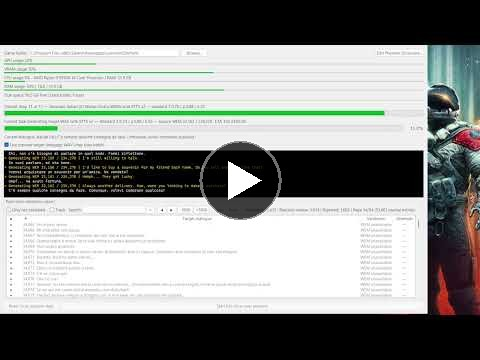

# GameDubber ALPHA

[](https://ko-fi.com/gerichoit)
[](https://github.com/sponsors/gericho)

Donations to support the project are greatly appreciated!

GameDubber is a local tool for creating AI voice-over mods for Bethesda games, initially designed for **Starfield**. It analyses a legitimate game installation in read-only mode, links subtitles to original voices, and generates new voice-over in a selected target language while aiming to preserve the original speaker’s **vocal identity, timing, emotional delivery, and speaking style**.

<p align="center">
  <a href="https://youtu.be/gCgq1zmRCkU"></a>
</p>

> Status: active ALPHA development. Do not distribute output containing identifiable performances or voices unless you hold the necessary rights.

## Supported games

- **Starfield 1.16.244** is the currently supported game version.
- Support for **Skyrim** and **The Elder Scrolls IV: Oblivion Remastered** is planned next.

## Features

- Read-only game-folder analysis: no Bethesda file is modified.
- Detection of BA2 archives, localisations, and available voice assets.
- Local indexing of subtitles, dialogue records, and voice paths through SQLite.
- Auditable matching between subtitles and original WEM audio files.
- Generation of voice-over for target languages whose subtitles are already available in the game.
- Local WEM → WAV extraction and Wwise Vorbis WEM conversion.
- Selectable TTS backends: XTTS v2, VoxCPM2, Qwen TTS, Chatterbox, and CosyVoice.
- Whisper ASR quality control with automatic regeneration for up to five attempts.
- Separate, user-editable phonetic dictionaries for each model.
- Real-time report to inspect, filter, preview, and manually validate every line.
- GPU/VRAM, CPU, RAM, and disk-space telemetry, with optional audio preview.
- Translation from an English transcription for dialogue with no official voice-over in the target language.

## Current pipeline

```text
Discovery → text/voice indexing → mapping → subtitle-driven TTS
→ Wwise WEM → ASR validation → regeneration up to 5 attempts
```

The current batch intentionally stops here. Exceptions, such as descriptive subtitles enclosed in asterisks, are recorded for a dedicated later stage: their English WEM will first be transcribed with ASR; if credible speech is found, it will be translated and generated, otherwise the original English voice will be retained.

## Planned stages

- Dedicated handling for exceptions and lines that do not pass validation.
- Translation of the original subtitles and generation of both text and voice-over in any target language supported by the selected language model.
- Assembly of a separate target-language BA2 archive, using Starfield-compatible voice paths and containing only newly generated local assets.
- Preparation of a mod that can be installed manually on PC and is compatible with Bethesda's official **Creations** system, subject to the applicable policies.

## Tested hardware

GameDubber has been tested on an **NVIDIA GeForce RTX 3070 Ti with 8 GB VRAM**, the baseline CUDA configuration. GPUs with more VRAM and higher AI performance can run larger models and substantially reduce GPU-bound ASR and TTS stages. Overall runtime also depends on CPU, storage, BA2 extraction, and Wwise processing.

## Distribution and privacy

This repository contains no AI models, Bethesda assets, dialogue, voice files, subtitles, generated output, or game data. All processed data remains in the user's local workspace.

The planned portable release will download only the backends required by the selected model on first run, verifying versions and hashes. Wwise and gated models will still require installation or licence acceptance by the user.

## Licensing and responsible use

Use only an authorised copy of the game and comply with the licences of all models, tools, and content involved. This project does not authorise redistribution of Bethesda assets or use of identifiable voices without permission.

[](https://ko-fi.com/gerichoit)
[](https://github.com/sponsors/gericho)
